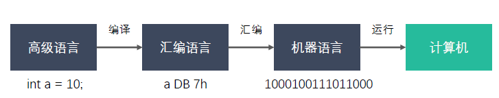
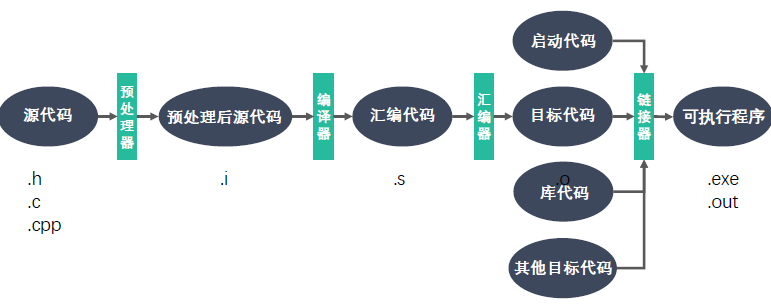
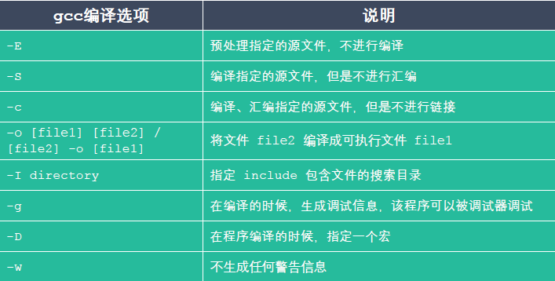
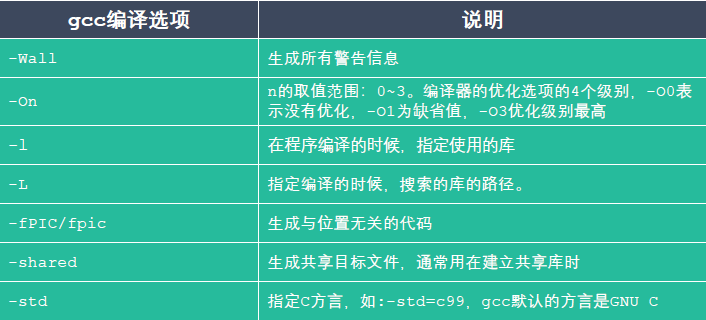

# GCC

### 什么是GCC

GCC 原名为GNU C语言编译器（GNU C Compiler）

GCC（GNU Compiler Collection，GNU编译器套件）是由GNU 开发的编程语言
译器。GNU 编译器套件包括C、C++、Objective-C、Java、Ada 和Go 语言前
端，也包括了这些语言的库（如libstdc++，libgcj等）

GCC 不仅支持C 的许多“方言”，也可以区别不同的C 语言标准；
可以使用命令行选项来控制编译器在翻译源代码时应该遵循哪个C 标准。
例如，当使用命令行参数`-std=c99` 启动GCC 时，编译器支持C99 标准。

安装命令sudo apt install gcc g++ （版本> 4.8.5）

查看版本gcc/g++ -v/--version

### 编程语言的发展

### GCC工作流程

### gcc 和g++ 的区别

gcc 和g++都是GNU(组织)的一个编译器。

误区一：gcc 只能编译c 代码，g++ 只能编译c++ 代码。两者都可以，请注意：

后缀为.c 的，gcc 把它当作是C 程序，而g++ 当作是c++ 程序

后缀为.cpp 的，两者都会认为是C++ 程序，C++ 的语法规则更加严谨一些

编译阶段，g++ 会调用gcc，对于C++ 代码，两者是等价的，
但是因为gcc命令不能自动和C++ 程序使用的库联接，所以通常用g++ 来完成链接，
为了统一起见，干脆编译/链接统统用g++ 了，这就给人一种错觉，好像cpp 程序只能用g++ 似的

误区二： gcc 不会定义 __cplusplus 宏，而 g++ 会

实际上，这个宏只是标志着编译器将会把代码按 C 还是 C++ 语法来解释

如上所述，如果后缀为 .c ，并且采用 gcc 编译器，则该宏就是未定义的，否则，
就是已定义

误区三：编译只能用 gcc ，链接只能用 g++

严格来说，这句话不算错误，但是它混淆了概念，应该这样说：编译可以用
gcc/g++ g++，而链接可以用 g++ 或者 gcc -lstdc++ 。

gcc 命令不能自动和 C++ 程序使用的库联接，所以通常使用 g++ 来完成联接。
但在编译阶段， g++ 会自动调用 gcc ，二者等价

### GCC常用参数选项

