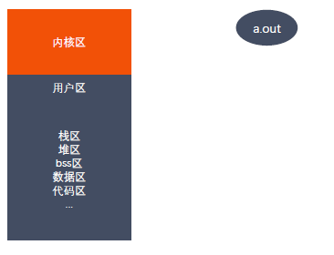

# exec函数族

### exec 函数族介绍

exec 函数族的作用是根据指定的文件名找到可执行文件，并用它来取代调用进程的
内容，换句话说，就是在调用进程内部执行一个可执行文件。

exec 函数族的函数执行成功后不会返回，因为调用进程的实体，包括代码段，数据
段和堆栈等都已经被新的内容取代，只留下进程 ID 等一些表面上的信息仍保持原样，
颇有些神似 三十六计 中的 金蝉脱壳 。看上去还是旧的躯壳，却已经注入了新的灵
魂。只有调用失败了，它们才会返回 -1 ，从原程序的调用点接着往下执行。

### exec函数族作用图解

### exec 函数族

◼ int execl(const char *path, const char *arg, .../* (char *) NULL */);

◼ int execlp(const char *file, const char *arg, ... /* (char *) NULL */);

◼ int execle(const char *path, const char *arg, .../*, (char *) NULL, char *const envp[] */);

◼ int execv(const char *path, char *const argv[]);

◼ int execvp(const char *file, char *const argv[]);

◼ int execvpe(const char *file, char *const argv[], char *const envp[]);

◼ int execve(const char *filename, char *const argv[], char *const envp[]);

l(list) 参数地址列表，以空指针结尾

v(vector) 存有各参数地址的指针数组的地址

p(path) 按PATH 环境变量指定的目录搜索可执行文件

e(environment) 存有环境变量字符串地址的指针数组的地址