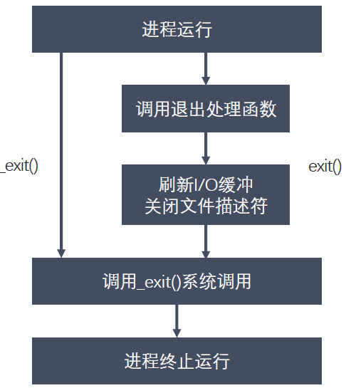

# 进程退出、孤儿进程、僵尸进程

### 进程退出
```
#include <stdlib.h>
void exit(int status);
#include <unistd.h>
void _exit(int status);
```


### 孤儿进程

父进程运行结束，但子进程还在运行（未运行结束），这样的子进程就称为孤儿进程
Orphan Process ）。

每当出现一个孤儿进程的时候，内核就把孤儿进程的父进程设置为 init ，而 init
进程会循环地 wait() 它的已经退出的子进程。这样，当一个孤儿进程凄凉地结束
了其生命周期的时候， init 进程就会代表党和政府出面处理它的一切善后工作。

因此孤儿进程并不会有什么危害。

### 僵尸进程
每个进程结束之后 , 都会释放自己地址空间中的用户区数据，内核区的 PCB 没有办法
自己释放掉，需要父进程去释放。

进程终止时，父进程尚未回收，子进程残留资源（ PCB ）存放于内核中，变成僵尸
Zombie ）进程。

僵尸进程不能被 kill -9 杀死，这样就会导致一个问题，如果父进程不调用 wait()
或 waitpid() 的话，那么保留的那段信息就不会释放，其进程号就会一直被占用，
但是系统所能使用的进程号是有限的，如果大量的产生僵尸进程，将因为没有可用的进
程号而导致系统不能产生新的进程，此即为僵尸进程的危害，应当避免。

### 进程回收
在每个进程退出的时候，内核释放该进程所有的资源、包括打开的文件、占用的内
存等。但是仍然为其保留一定的信息，这些信息主要主要指进程控制块 PCB 的信息
（包括进程号、退出状态、运行时间等）。

父进程可以通过调用 wait 或 waitpid 得到它的退出状态同时彻底清除掉这个进程。

wait() 和 waitpid() 函数的功能一样，区别在于， wait() 函数会阻塞，
waitpid() 可以设置不阻塞， waitpid() 还可以指定等待哪个子进程结束。

注意：一次 wait 或 waitpid 调用只能清理一个子进程，清理多个子进程应使用循环。

### 退出信息相关宏函数

WIFEXITED(status) 非 0 ，进程正常退出

WEXITSTATUS(status) 如果上宏为真，获取进程退出的状态（ exit 的参数）

WIFSIGNALED(status) 非 0 ，进程异常终止

WTERMSIG(status) 如果上宏为真，获取使进程终止的信号编号

WIFSTOPPED(status) 非 0 ，进程处于暂停状态

WSTOPSIG(status) 如果上宏为真，获取使进程暂停的信号的编号

WIFCONTINUED(status) 非 0 ，进程暂停后已经继续运行