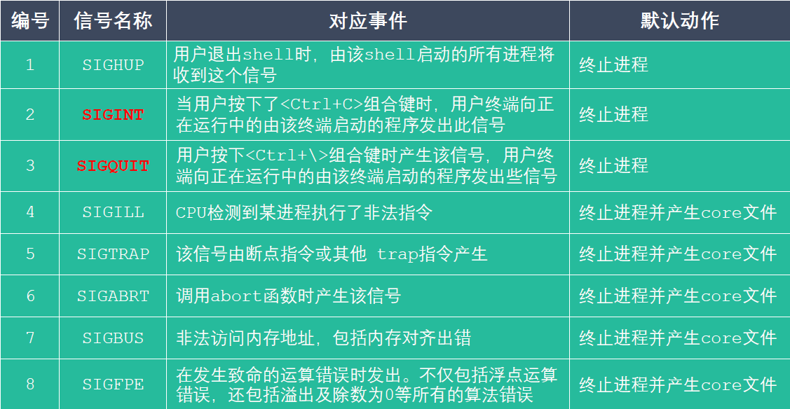
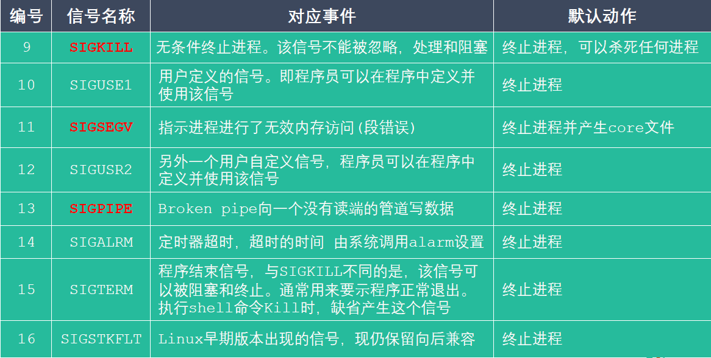
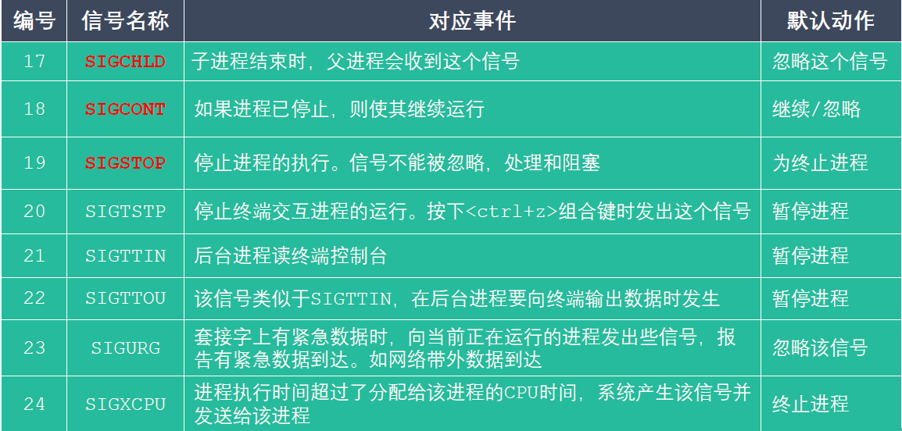
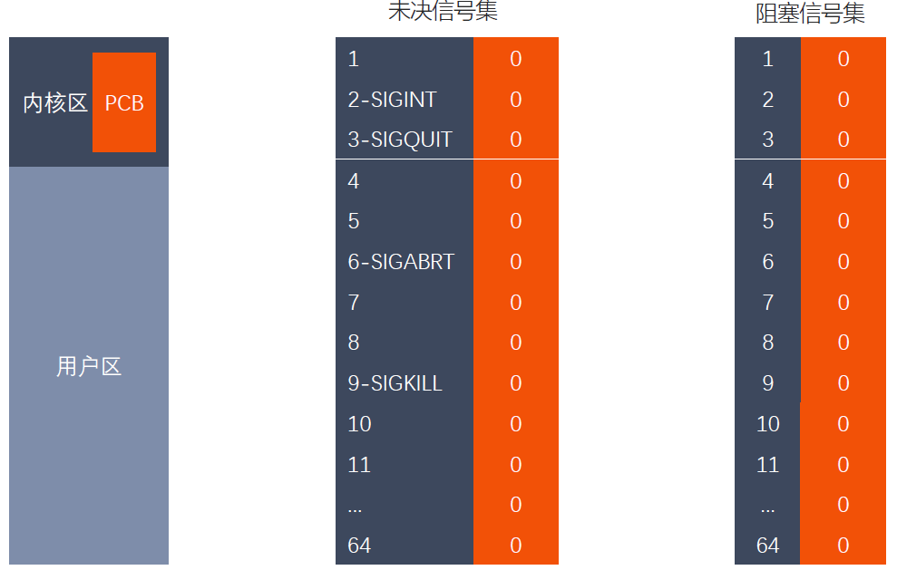
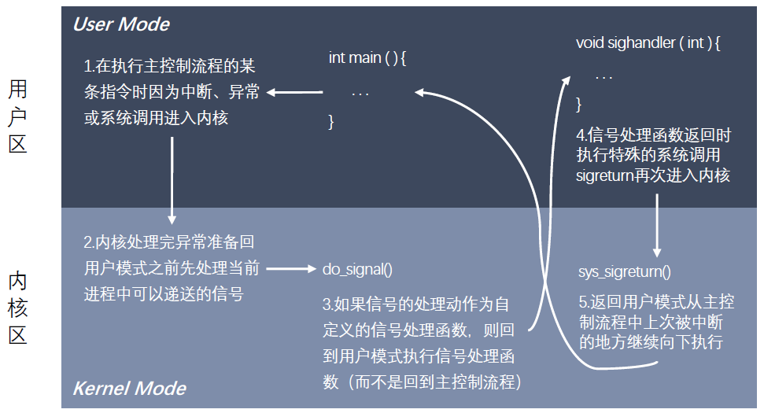

# 信号

### 信号的概念

信号是 Linux 进程间通信的最古老的方式之一，是事件发生时对进程的通知机制，有时也
称之为软件中断，它是在软件层次上对中断机制的一种模拟，是一种异步通信的方式。信号
可以导致一个正在运行的进程被另一个正在运行的异步进程中断，转而处理某一个突发事件。

发往进程的诸多信号，通常都是源于内核。引发内核为进程产生信号的各类事件如下：

    对于前台进程，用户可以通过输入特殊的终端字符来给它发送信号。比如输入 Ctrl+C
    通常会给进程发送一个中断信号。

    硬件发生异常，即硬件检测到一个错误条件并通知内核，随即再由内核发送相应信号给
    相关进程。比如执行一条异常的机器语言指令，诸如被 0 除，或者引用了无法访问的
    内存区域。

    系统状态变化，比如 alarm 定时器到期将引起 SIGALRM 信号，进程执行的 CPU
    时间超限，或者该进程的某个子进程退出。

    运行 kill 命令或调用 kill 函数。

使用信号的两个主要目的是：

    让进程知道已经发生了一个特定的事情。

    强迫进程执行它自己代码中的信号处理程序。

信号的特点：

    简单

    不能携带大量信息

    满足某个特定条件才发送

    优先级比较高

查看系统定义的信号列表： kill -l

前 31 个信号为常规信号，其余为实时信号。

### Linux 信号一览表








### 信号的
5 种默认处理动作

查看信号的详细信息： man 7 signal

信号的 5 中默认处理动作

    Term 终止进程

    Ign 当前进程忽略掉这个信号

    Core 终止进程，并生成一个 Core 文件

    Stop 暂停当前进程

    Cont 继续执行当前被暂停的进程

信号的几种状态：产生、未决、递达

SIGKILL 和 SIGSTOP 信号不能被捕捉、阻塞或者忽略，只能执行默认动作。

### 信号相关的函数
```
int kill(pid_t pid, int sig);

int raise(int sig);

void abort(void);

unsigned int alarm(unsigned int seconds);

int setitimer(int which, const struct itimerval *new_val,
struct itimerval *old_value);
```

### 信号捕捉函数

```
sighandler_t signal(int signum, sighandler_t handler);

int sigaction(int signum, const struct sigaction *act,
struct sigaction *oldact);
```

### 信号集

许多信号相关的系统调用都需要能表示一组不同的信号，多个信号可使用一个称之为
信号集的数据结构来表示，其系统数据类型为 sigset_t 。

在 PCB 中有两个非常重要的信号集。一个称之为 “阻塞信号集 ”，另一个称之为
“未决信号集 。这两个信号集都是内核使用位图机制来实现的。但操作系统不允许我
们直接对这两个信号集进行位操作。而需自定义另外一个集合，借助信号集操作函数
来对 PCB 中的这两个信号集进行修改。

信号的 “未决 是一种状态，指的是从信号的产生到信号被处理前的这一段时间。

信号的 “阻塞 是一个开关动作，指的是阻止信号被处理，但不是阻止信号产生。

信号的阻塞就是让系统暂时保留信号留待以后发送。由于另外有办法让系统忽略信号，
所以一般情况下信号的阻塞只是暂时的，只是为了防止信号打断敏感的操作。

### 阻塞信号集和未决信号集



### 信号集相关的函数
```
int sigemptyset(sigset_t *set);

int sigfillset(sigset_t *set);

int sigaddset(sigset_t *set, int signum);

int sigdelset(sigset_t *set, int signum);

int sigismember(const sigset_t *set, int signum);

int sigprocmask(int how, const sigset_t *set, sigset_t *oldset);

int sigpending(sigset_t *set);
```

### 内核实现信号捕捉的过程



### SIGCHLD 信号
SIGCHLD 信号产生的条件

    子进程终止时

    子进程接收到 SIGSTOP 信号停止时

    子进程处在停止态，接受到 SIGCONT 后唤醒时

以上三种条件都会给父进程发送 SIGCHLD 信号，父进程默认会忽略该信号