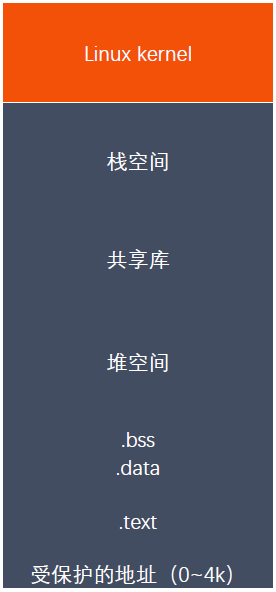

# 线程

### 线程概述

与进程（ process ）类似，线程 thread ）是允许应用程序并发执行多个任务的一种机
制。一个进程可以包含多个线程。同一个程序中的所有线程均会独立执行相同程序，且共
享同一份全局内存区域，其中包括初始化数据段、未初始化数据段，以及堆内存段。（传
统意义上的 UNIX 进程只是多线程程序的一个特例，该进程只包含一个线程）

进程是 CPU 分配资源的最小单位，线程是操作系统调度执行的最小单位。

线程是轻量级的进程（ LWP Light Weight Process ），在 Linux 环境下线程的本
质仍是进程。

查看指定进程的 LWP 号： ps Lf pid

### 线程和进程区别

进程间的信息难以共享。由于除去只读代码段外，父子进程并未共享内存，因此必须采用
一些进程间通信方式，在进程间进行信息交换。

调用 fork() 来创建进程的代价相对较高，即便利用写时复制技术，仍然需要复制诸如
内存页表和文件描述符表之类的多种进程属性，这意味着 fork() 调用在时间上的开销
依然不菲。

线程之间能够方便、快速地共享信息。只需将数据复制到共享（全局或堆）变量中即可。

创建线程比创建进程通常要快 10 倍甚至更多。线程间是共享虚拟地址空间的，无需采
用写时复制来复制内存，也无需复制页表。

### 线程和进程虚拟地址空间

### 线程之间共享和非共享资源

共享资源

    进程 ID 和父进程 ID

    进程组 ID 和会话 ID

    用户 ID 和 用户组 ID

    文件描述符表

    信号处置

    文件系统的相关信息：文件权限掩码(umask)、当前工作目录

    虚拟地址空间(除栈、 .text)

非共享资源

    线程 ID

    信号掩码

    线程特有数据

    error 变量

    实时调度策略和优先级

    栈，本地变量和函数的调用链接信息

### NPTL

当 Linux 最初开发时，在内核中并不能真正支持线程。但是它的确可以通过 clone()
系统调用将进程作为可调度的实体。这个调用创建了调用进程（ calling process ）的
一个拷贝，这个拷贝与调用进程共享相同的地址空间。 LinuxThreads 项目使用这个调用
来完成在用户空间模拟对线程的支持。不幸的是，这种方法有一些缺点，尤其是在信号处
理、调度和进程间同步等方面都存在问题。另外，这个线程模型也不符合 POSIX 的要求。

要改进 LinuxThreads ，需要内核的支持，并且重写线程库。有两个相互竞争的项目开始
来满足这些要求。一个包括 IBM 的开发人员的团队开展了 NGPT Next Generation
POSIX Threads ）项目。同时 Red Hat 的一些开发人员开展了 NPTL 项目。 NGPT
在 2003 年中期被放弃了，把这个领域完全留给了 NPTL 。

NPTL ，或称为 Native POSIX Thread Library ，是 Linux 线程的一个新实现，它
克服了 LinuxThreads 的缺点，同时也符合 POSIX 的需求。与 LinuxThreads 相
比，它在性能和稳定性方面都提供了重大的改进。

查看当前 pthread 库版本： getconf GNU_LIBPTHREAD_VERSION

### 线程操作

int pthread_create(pthread_t *thread, const pthread_attr_t *attr,void *(*start_routine) (void *), void *arg);

pthread_t pthread_self(void);

int pthread_equal(pthread_t t1, pthread_t t2);

void pthread_exit(void *retval);

int pthread_join(pthread_t thread, void **retval);

int pthread_detach(pthread_t thread);

int pthread_cancel(pthread_t thread);

### 线程属性

线程属性类型 pthread_attr_t

int pthread_attr_init(pthread_attr_t *attr);

int pthread_attr_destroy(pthread_attr_t *attr);

int pthread_attr_getdetachstate(const pthread_attr_t *attr, int* detachstate)

int pthread_attr_setdetachstate(pthread_attr_t *attr, int detachstate);