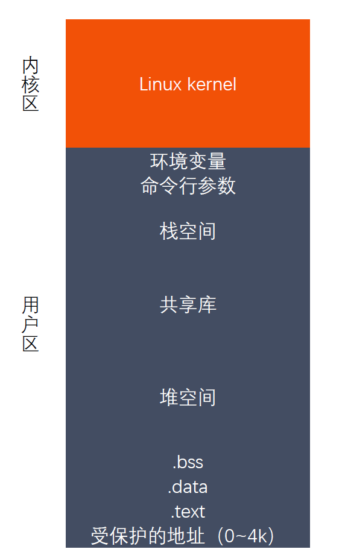
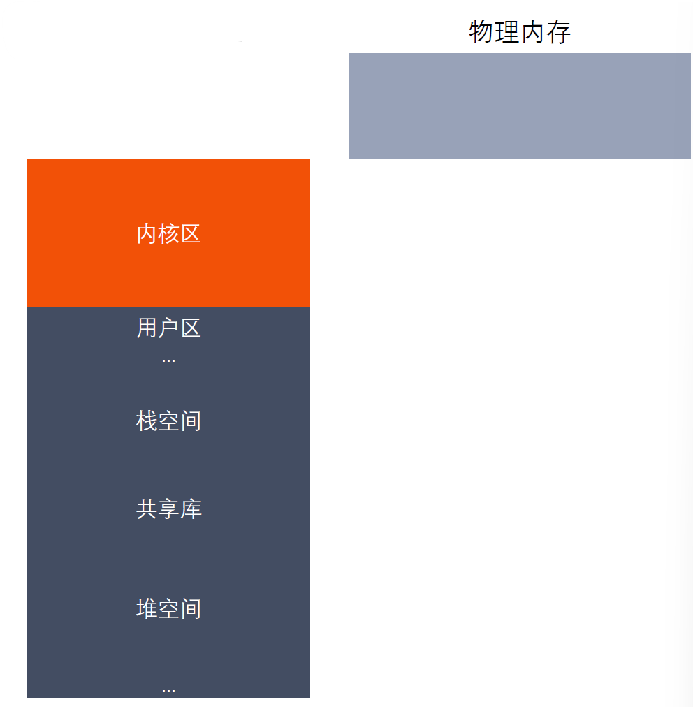

# 进程创建

### 进程创建

系统允许一个进程创建新进程，新进程即为子进程，子进程还可以创建新的子进程，形成
进程树结构模型。
```
#include <sys/types.h>
#include <unistd.h>
pid_t fork(void);
```
返回值：
 
 成功：子进程中返回0，父进程中返回子进程ID

 失败：返回-1

失败的两个主要原因：
    
当前系统的进程数已经达到了系统规定的上限，这时errno 的值被设置为EAGAIN

系统内存不足，这时errno 的值被设置为ENOMEM

### 父子进程虚拟地址空间





### GDB多进程调试

使用GDB 调试的时候，GDB 默认只能跟踪一个进程，可以在fork 函数调用之前，通
过指令设置GDB 调试工具跟踪父进程或者是跟踪子进程，默认跟踪父进程。

设置调试父进程或者子进程：set follow-fork-mode [parent（默认）| child]

设置调试模式：set detach-on-fork [on | off]

默认为on，表示调试当前进程的时候，其它的进程继续运行，如果为off，调试当前进
程的时候，其它进程被GDB 挂起。

查看调试的进程：info inferiors

切换当前调试的进程：inferior id

使进程脱离GDB 调试：detach inferiors id