# standlua脚本合集配置教程

## 1.配置git环境

[点此下载git安装环境软件](https://registry.npmmirror.com/-/binary/git-for-windows/v2.47.1.windows.1/Git-2.47.1-64-bit.exe)

下载完成后直接打开，进入如下图安装步骤，然后就一直next就行了，什么都不用管，全部默认，全部next

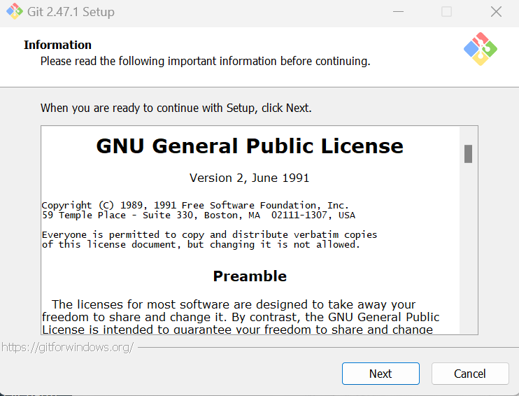

如下图就是安装完成了，别打勾，然后finish

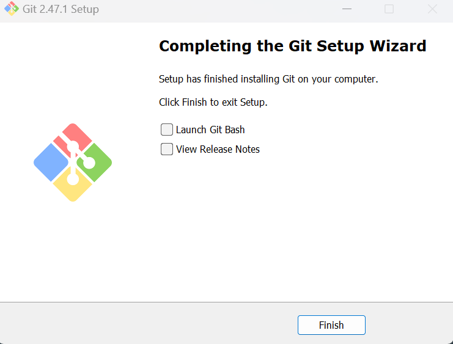

## 2.注册GitHub账号

若已有GitHub账号直接跳过此步骤，看第3步

进入GitHub注册地址：https://github.com/signup

如下图输入邮箱密码和用户名

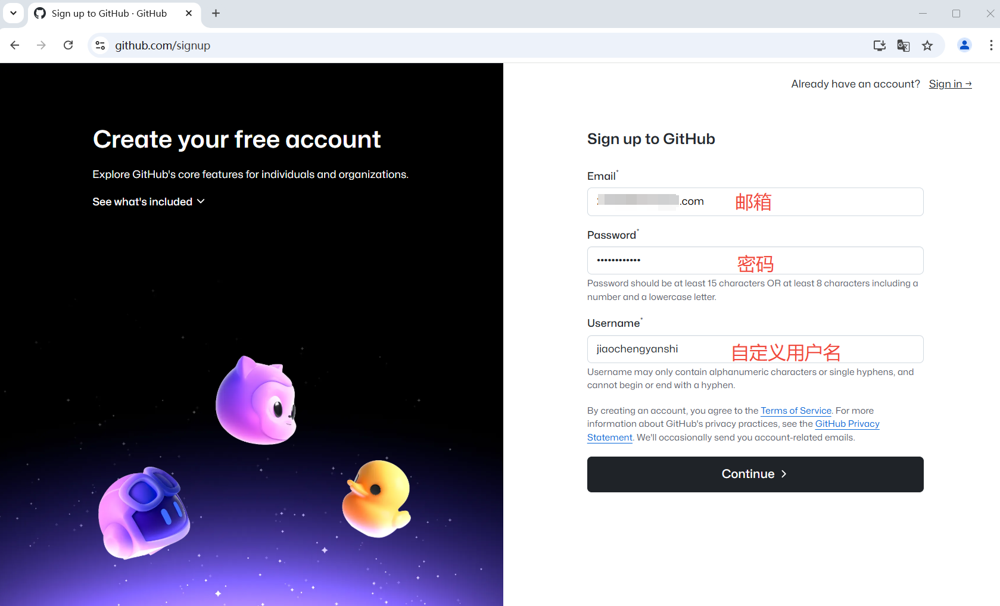

下图过验证

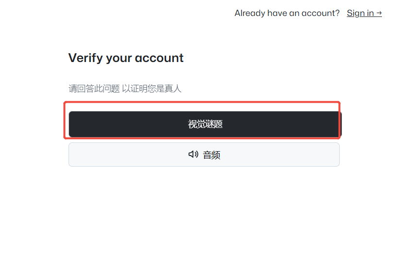

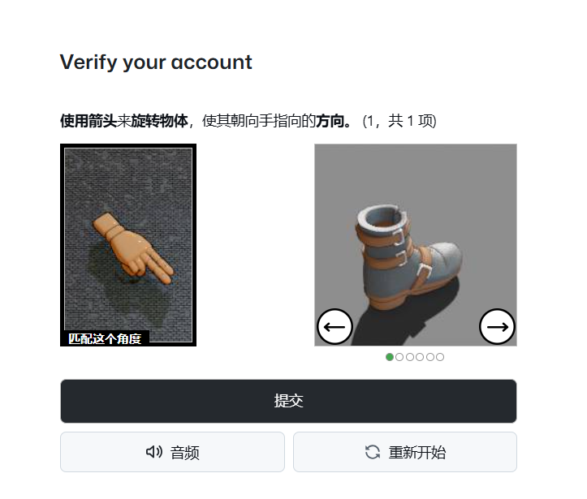

成功后如下图输入邮箱中获得的验证码

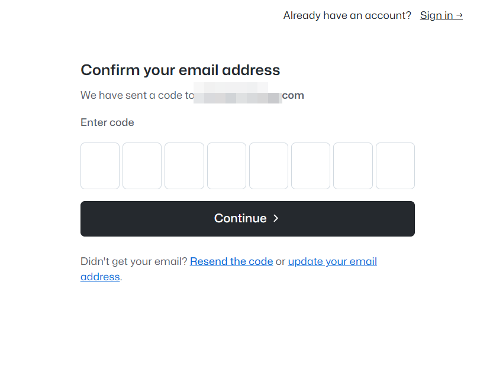

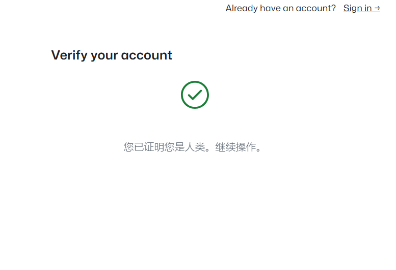

下图中输入邮箱密码登录GitHub

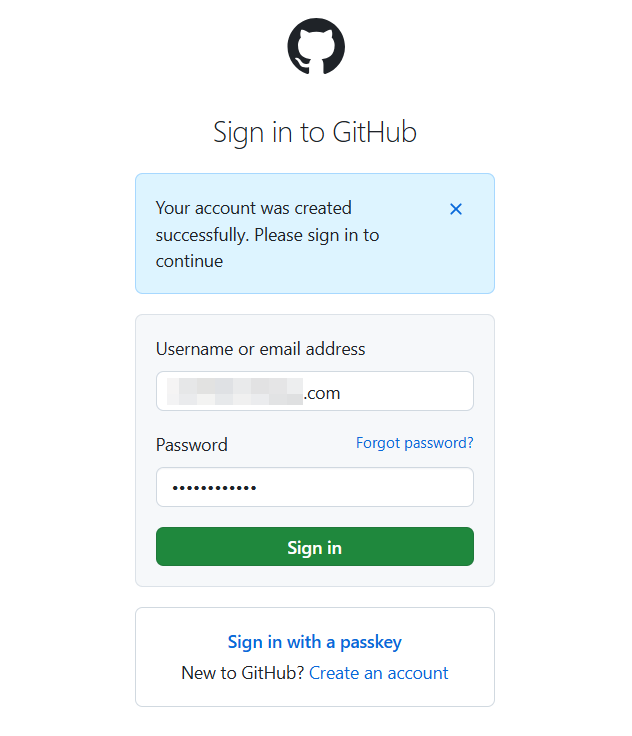

如下图就是登录成功了

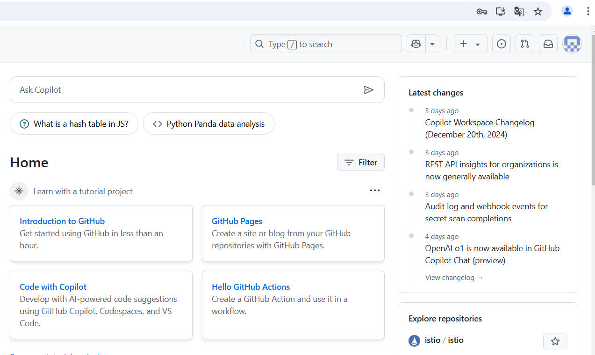

## 3.拉取Stand lua仓库

接下来点击下方链接进入stand的lua库

https://github.com/xhcherry/GTA5-Stand-LuaAIO

**点击下图红框中的⭐star支持一下,非常感谢**

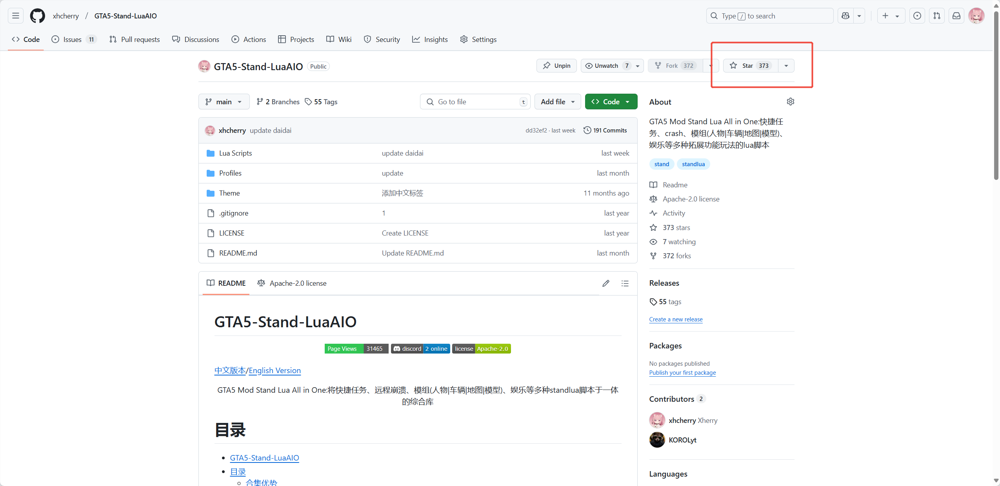

按照下图顺序点击code，点击复制按钮，此时会复制仓库git地址

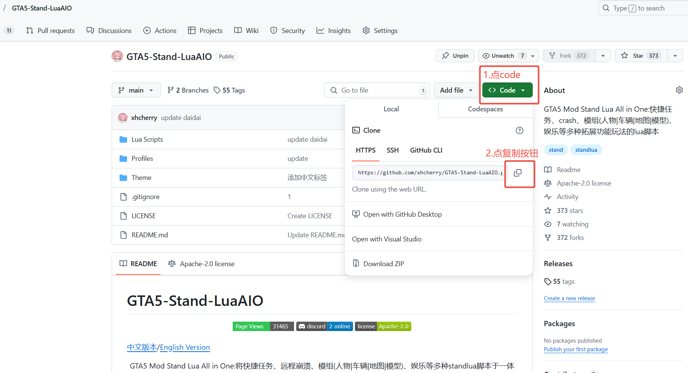

然后在你电脑合适的位置(这里演示用桌面)，在桌面空白处右键选择'在终端中打开'\
如下图在desktop路径中输入:
```shell
git clone
```

然后按下ctrl+v粘贴刚刚复制的地址,就会如下图显示一样(注意clone后面有一个空格)

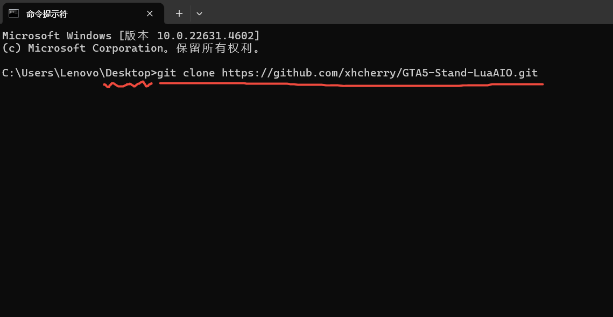

按下回车键，然后就会开始克隆，如下图

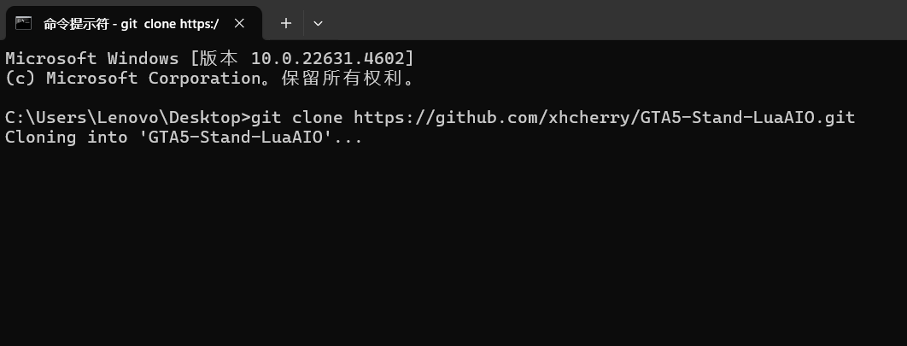

克隆成功后如下图显示(要是出现failed就是网络问题，可以按方向键 ↑ 再次尝试)

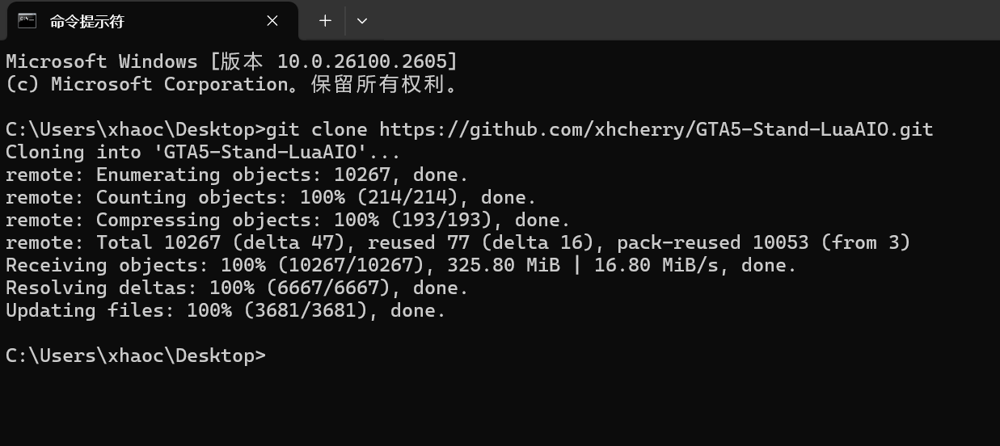

在桌面打开GTA5-Stand-LuaAIO文件夹，如下图步骤操作

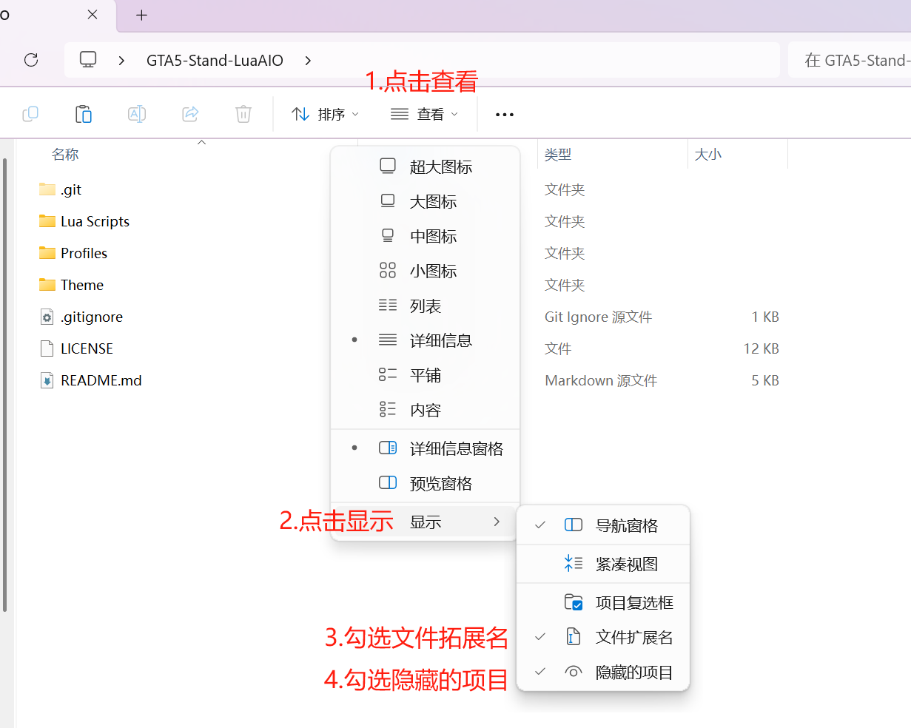

操作完成后如下图可以看见.git文件夹

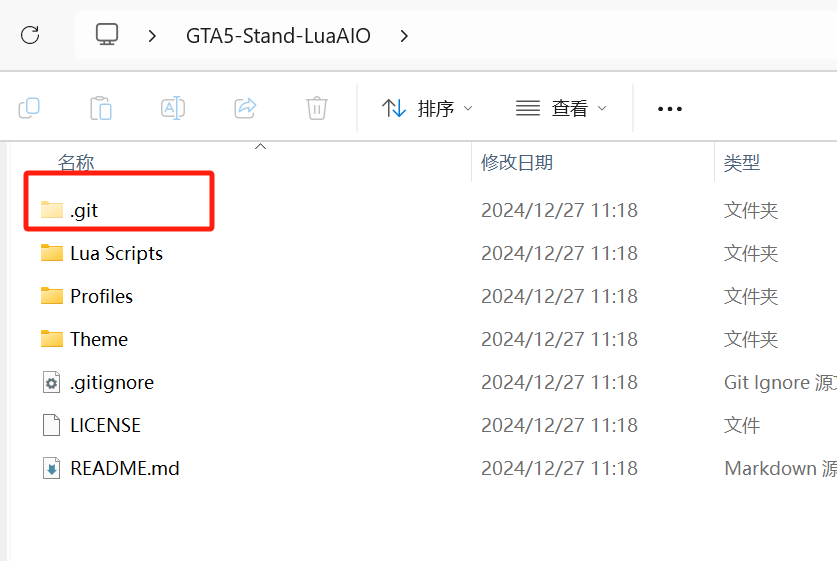

## 4.安装lua合集到stand中

先打开stand目录(在C:\用户\你的用户名\AppData\Roaming\Stand)\
也可以用安装器或者官方注入器打开stand文件夹

将GTA5-Stand-LuaAIO文件夹中的所有文件复制到stand文件夹中\
如下图，将右边所有文件复制到左边，并且全部覆盖\
覆盖完成后，在左图检查红框中的文件都存在就是成功

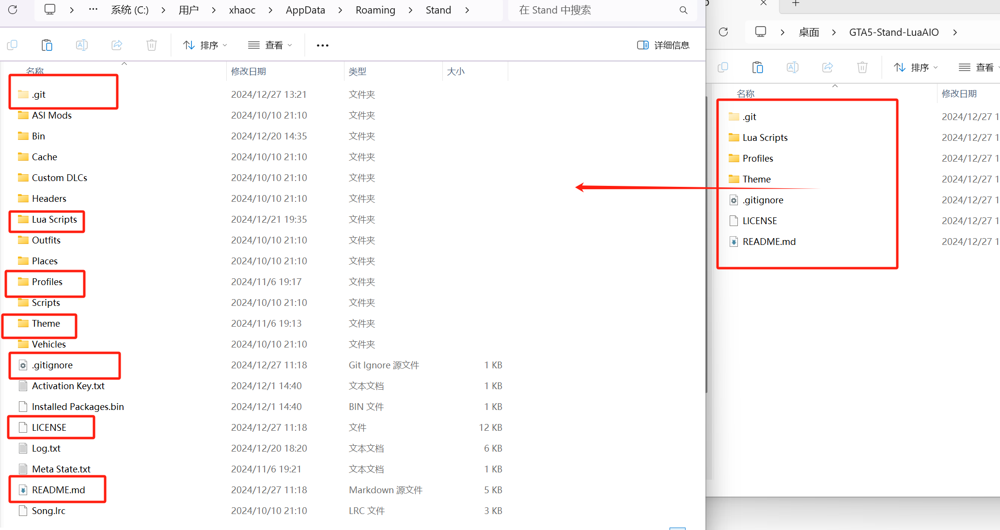

然后就可以正常玩游戏了

## 5.快捷更新

日后lua更新了之后（会在discord中通知）

在Stand文件夹中右键选择'在终端中打开'\

然后输入 ```git pull``` 回车后就会自动更新了

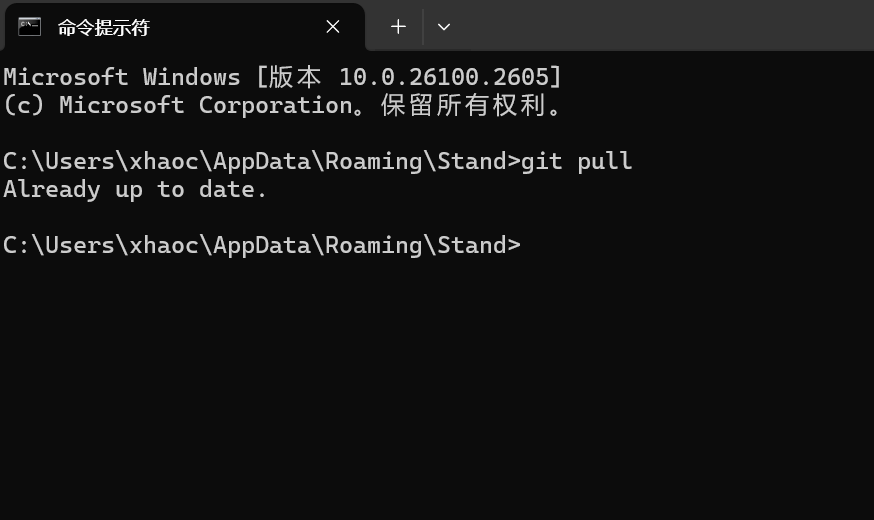

然后正常玩游戏使用即可